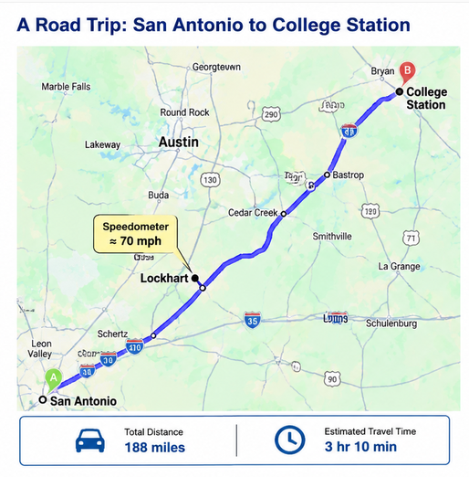

## Motivation
Derivatives show up at many places in our routine day to day life.  For example, whenever you look at the speedometer of your vehicle, you are looking at the value of the derivative of your distance with respect to that time.  Let us first conceptually explore the idea, before we dig into the mathematics of it.

## Think Before You Explore

---

{width=100%}

*Figure 4.1. Route from San Antonio to College Station.*

---

You are driving from **Texas A&M University–San Antonio** to **Texas A&M University College Station**.  The distance is **188 miles** and the approximate travel time  is **3h 10 m (3.167 hours)**.  Suppose that near **Lockhart, Texas**, your speedometer reads **70 mph**.  Based on this information, try and answer the following questions:

---

**Question 1**

Estimate your **average speed** for the entire trip.

(Hint: Average speed = Distance ÷ Time)

<details>
<summary><b>Show Answer</b></summary>

The trip takes

$$
3+\frac{10}{60}=3.167 \text{ hr}
$$

Therefore,

$$
\frac{188}{3.167} \approx59.4 \text{ mph}
$$

So the average speed is approximately **59 mph**.

</details>

---

**Question 2**

Your speedometer reads **70 mph** near Lockhart.

What does this number represent?

- Instantaneous speed
- Average speed
- Both

<details>
<summary><b>Show Answer</b></summary>

The speedometer measures your **instantaneous speed**—how fast you are traveling **right now**.

It does **not** measure your average speed for the entire trip.

</details>

---

**Question 3**

Suppose your speedometer continues to read **70 mph** for the next minute.

Can you determine exactly when you will arrive in College Station?

<details>
<summary><b>Show Answer</b></summary>

**No.**

Knowing your speed at one instant tells you very little about the remainder of the trip.

Traffic, construction, speed limits, weather, and future stops will all affect your arrival time.

Instantaneous speed cannot determine your average speed for the entire trip.

</details>

---

## Conceptual Definition of a Derivative
A derivative tells us how the slope of a function changes at any given point.  In most cases, we cannot precisely measure this.  Therefore, we measure it by seeing how the function changes when we move slightly from that point.

## Mathematical Definition of a Derivative
Consider a function f(x).  Now, we want to find the derivative at a point x = a.  We can compute f(a).  This tells us the value of  the function at x = a but not its slope.  To obtain the slope at that point, we take take another point close by (a + h) and compute the following:


$$
f'(a)
=
\left.\frac{df}{dx}\right|_{x=a}
=
\lim_{h \to 0}
\frac{f(a+h)-f(a)}{h}
$$

In other words we want to calculate the instantaneous change of f(x) for a small change in x at any given point where x = a.

## Why do we Study Derivatives?

Derivatives help us understand many things such as changes in temperature and how it impacts our body (when you get a fever, your body temperature has instantaneously changed to a higher value and as a result you feel sick).  It also helps us understand how your speedometer in your car tell us the instantaneous velocity (say 30 mph) and how you can use your steering and brakes to change to another value to either move quickly or slowly.  A flood gage tells you how the river height changes over time in response to rainfall and heat.  Look around and you will see how calculus helps us think about changes of one variable and how it impacts something that depends on it.


## Exploratory Example

In this example you will understand how the derivative changes with time in a rollercoaster.  When the derivative (or the instantaneous slope) is negative you will feel the push towards the ground due to gravity, while the slope is positive you will feel the pull away from the ground.  Roller coasters suddenly change the instaneous slopes,(both direction and magnitude), or derivatives to create thrill!!

---

**Instructions**

-  Move the sliders and answer the questions below.

---

::: {.callout-tip}
## 🚀 Interactive Exploration

Use the interactive notebook to explore how the derivative changes over time in a roller coaster.

<iframe src="https://marimo.app/github/vuddameri/Calculus-I/blob/main/Code/rollercoaster1.py?embed=true" sandbox="allow-scripts allow-same-origin allow-downloads allow-popups allow-forms" allowfullscreen width="100%" height="700" frameborder="0"></iframe>
:::

## Summary

In this activity you discovered that

- A derivative measures **change**.
- The derivative depends on **where** you are on the graph.
- The tangent line gives the **instantaneous rate of change**.
- A derivative has physical meaning—in this example, it represents velocity.

---

## Check Your Understanding

```{quizdown}

# 1. What does the derivative of a position function represent?

- [ ] The total distance traveled.
- [x] The instantaneous speed (or velocity) at a particular instant.
- [ ] The average speed over the entire trip.
- [ ] The highest speed reached.

# 2. A car travels 120 meters in 6 seconds. What does 20 m/s represent?

- [ ] The car's instantaneous speed at exactly 6 seconds.
- [x] The car's average speed over the 6-second interval.
- [ ] The acceleration of the car.
- [ ] The derivative of the position function at every instant.


# 3. As the time interval becomes smaller and smaller, the average speed approaches:

- [ ] The total distance traveled.
- [ ] Zero.
- [x] The instantaneous speed (the derivative).
- [ ] The acceleration.

# 4. If the derivative of a function is zero at a point, what does the graph look like there?

- [ ] The graph is vertical.
- [ ] The graph has a slope of 1.
- [x] The tangent line is horizontal.
- [ ] The function must equal zero.

# 5. A roller coaster reaches the very top of a hill before beginning to descend. What is most likely true about the derivative of its height at that instant?

- [ ] The derivative is very large and positive.
- [ ] The derivative is very large and negative.
- [x] The derivative is approximately zero because the slope is horizontal.
- [ ] The derivative does not exist because the coaster stops.


```


::: {.callout-tip collapse="true"}
## Answers and Explanation

**Question 1**

**Explanation:** The derivative measures how rapidly position is changing at one specific instant in time. It is the instantaneous speed (or velocity).

---

**Question 2**

**Explanation:** Average speed is computed over a time interval. Instantaneous speed is obtained by taking the derivative.

---

**Question 3**

**Explanation:** The derivative is defined as the limit of the average rate of change as the time interval approaches zero.

---

**Question 4**

**Explanation:** A derivative of zero means the tangent line has zero slope. The function value itself does not have to be zero.

---

**Question 5**

**Explanation:** At the highest point, the tangent to the height curve is horizontal, so the derivative is approximately zero even though the coaster continues moving forward.

---

:::
